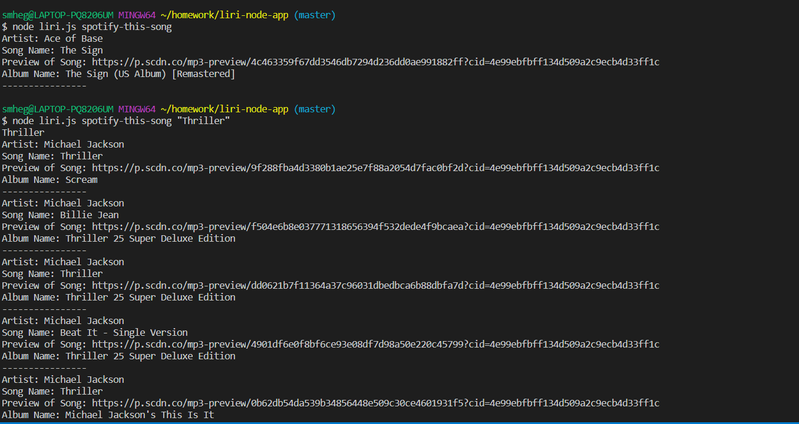
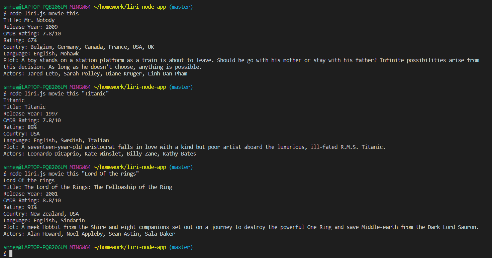

# LIRI - Language Interpretation and Recognition Interface

## Overview
LIRI is a command line `node js` app that takes command line parameters and returns the data retrieved from different web API's.      Here are LIRI-commands: 
* `concert-this` 
* `spotify-this-song`
* `movie-this`
* `do-what-it-says`

Result will be displayed on the terminal and will also be appended to `log.txt`

## What each command does:
(1) `concert-this <artist/band name here>`:
This command will search the [_Bands in Town Artist Events_](https://artists.bandsintown.com/support/bandsintown-api) API for the artist/band name and returns the following information about each event to the terminal: 
* Name of the venue,
* Venue location,
* Date of the Event.

(2) `spotify-this-song <song name here>`: This command uses [_Spotify API_](https://developer.spotify.com/documentation/web-api/) to fetch details like, 
* Song name
* Song artist,
* Preview link of song from Spotify,
* Album name.

If no song name is provided, then it defaults to "The Sign" by Ace of Base.

(3) `movie-this <movie name here>`: This command makes use of [_OMDB_](http://www.omdbapi.com/) API to search movie details like, 
* Release year,
* Country,
* Language,
* IMDB rating, 
* Rotten Tomatoes rating,
* Movie plot, 
* Actors. 

If no movie name is provided, then it defaults to "Mr. Nobody" movie.

(4) `do-what-it-says`: LIRI will execute command from random.txt file.Current command in _random.txt_ is `spotify-this-song,"I want it that way"`

## Prerequisite
`Node.js - Download the latest version of Node https://nodejs.org/en/`

## Getting Started
* Clone this repository.
* On your CLI terminal execute command `npm install` to install the dependancies.
* Set following environmental variables
* APP_ID = _your Bands in town artist event API key_
* SPOTIFY_ID = _your spotify api id_
* SPOTIFY_SECRET = _your spotify api secret key_

To execute the script use syntax:
`node liri.js <LIRI-command> <Artist Name/Band Name/Movie Name/Track Name>`

## Technologies Used
* NodeJS
* JavaScript
* Bandsintown API
* Spotify API
* OMDB API
* NPM fs
* NPM dotenv
* NPM request
* Moment.js
* NPM axios
